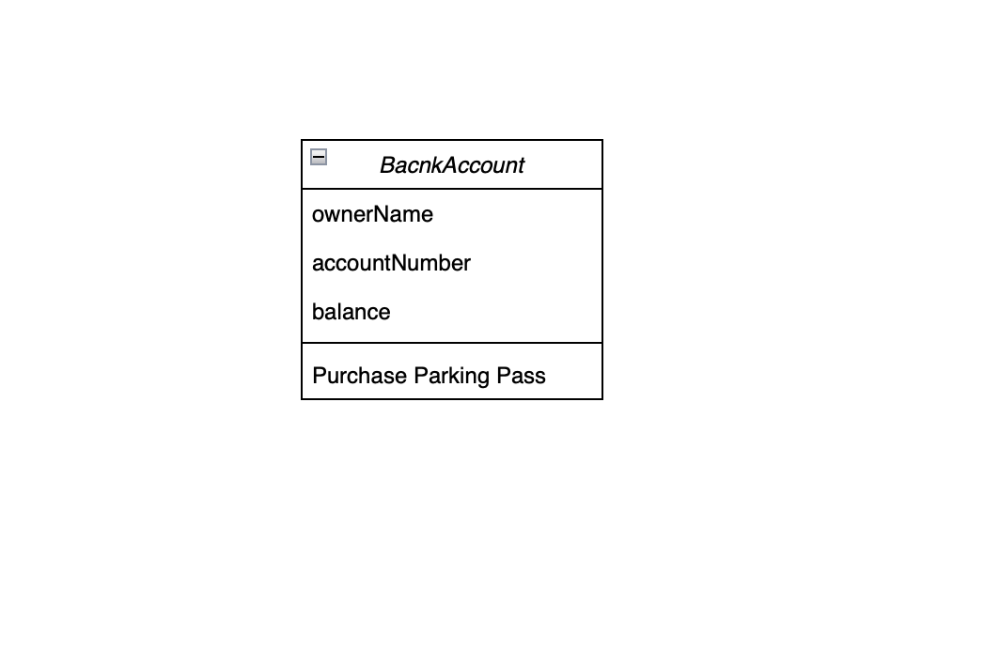

# 은행 만들기 프로젝트

## 실행방법

1. javaBank 폴더를 다운받는다.
2. javaBank 폴더 내부에 있는 Main 클래스를 실행한다.

## 업무흐름도

   
1. 계좌 생성
   1. 사용자의 이름, 통장 번호, 잔액을 할당하여 계좌를 개설한다.
2. 요청 업무 처리
   1. 입금
      1. 계좌에 요청된 금액만큼 입금한다.
   2. 출금
        1. 출금 요청된 금액이 잔액보다 클 경우, 잔액 부족 메세지를 출력한다.
      2. 출금 요청된 금액이 잔액보다 작거나 같을 경우, 출금을 진행한다.
3. 조회
    1. 요청 업무가 처리된 후, 계좌의 정보를 출력한다.
4. 종료

## 요구사항

## 테이블

## 프로젝트 구조
- Main 클래스
  - 계좌 정보 입력
  - 출력 요청
- BankAccount
  - Main에서 전달된 정보를 토대로 계좌를 개설
  - 입금, 출금 업무를 담당함
  - init으로 계좌 초기화
  - 계좌 정보 출력

## 사용 프레임워크 및 라이브러리
