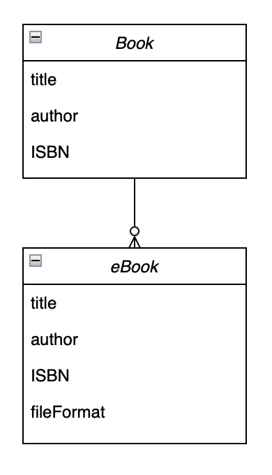

# 은행 만들기 프로젝트

## 실행방법

1. javaLibrary 폴더를 다운받는다.
2. javaLibrary 폴더 내부에 있는 Main 클래스를 실행한다.

## 업무흐름도

1. Book 객체 생성
    1. 책 제목, 저자, ISBN 값을 받아 Book 객체를 생성한다.
2. eBook 객체 생성
    1. eBook 객체는 Book 객체를 상속받는다.
    2. 책 제목, 저자, ISBN, 포멧 값을 받아 eBook 객체를 생성한다. 
3. 조회
    1. 요청 업무가 처리된 후, Book 객체와 eBook 객체의 정보를 출력한다.
4. 종료

## 요구사항

## 테이블

## 프로젝트 구조
- Main 클래스
    - Book 객체 생성
    - eBook 객체 생성
    - 출력 요청
- Book 클래스
    - Main에서 전달된 정보를 토대로 Book 객체를 생성
    - 인스턴스로 책 제목, 저자, ISBN을 지니고 있다.
    - 초기화
    - 객체 정보 출력
- eBook 클래스
    - Main에서 전달된 정보를 토대로 eBook 객체를 생성
    - Book 클래스를 상속받는다.
    - 인스턴스로 책 제목, 저자, ISBN, 타입을 지니고 있다.
    - 초기화
    - Book 클래스의 객체 정보 출력 메서드를 오버라이드 한다.
    - 객체 정보 출력

## 사용 프레임워크 및 라이브러리
