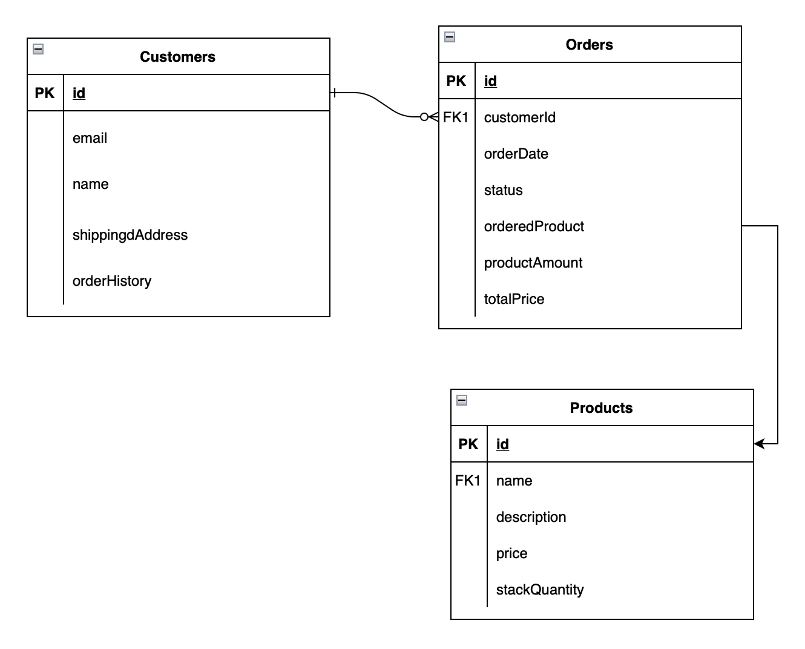

# 은행 만들기 프로젝트

## 실행방법

1. javaBank 폴더를 다운받는다.
2. javaBank 폴더 내부에 있는 Main 클래스를 실행한다.

## 업무흐름도
1. custromer 생성
   1. customerId, email, name, shippingAddress 값을 받아 customer 객체를 생성한다.
2. product 생성
   1. productId, name, description, price, stackQauntity 값을 받아 product 값을 받아 product 객체를 생성한다. 
3. order 생성
   1. order 생성시 customer, product, quantity 값을 받아 order 객체를 생성한다.
   2. order 생성시 customer의 orderList에 order 객체를 추가한다.

## 요구사항
1. customer의 정보를 수정가능하게 한다.
2. product의 수량 정보가 주문에 따라 반영되도록 한다.
3. product의 값에 할인율을 적용 가능하도록 한다.
4. customer의 orderList에 order을 추가할 때, 해당 유저의 주문이 아닐 경우 오류 메세지를 출력한다.

## 테이블

## 프로젝트 구조

## 사용 프레임워크 및 라이브러리